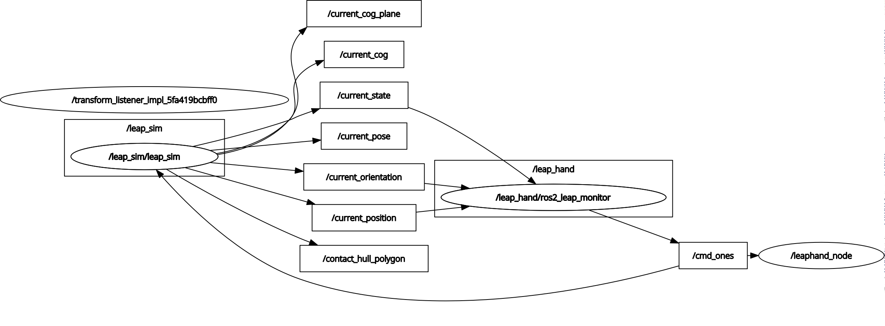

# Ros2 Package for LEAP Hand control
This ros2 package allow for the control and analysis of the LEAP Hand built for the Human Centered Robotics Praktikum at KIT in 2024/25.
The package structure is as visualized in the graph:

The package is only a starting point for development. For a more tested and usable script see (https://github.com/lars-ehrlich/LEAP_HAND_viz).

## Package Structure
The package is organized as follows:
- **src/**: Contains the source code for the nodes and utilities.
- **launch/**: Includes launch files for starting the nodes and setting up the simulation.
- **config/**: Holds configuration files for parameters and settings.
- **media/**: Stores media files such as images and diagrams.
- **msg/**: Defines custom message types used in the package.
- **srv/**: Contains service definitions for inter-node communication.

## Node Layout
The package includes the following nodes:
- **leap_monitor**: Handles the control logic for the LEAP Hand, including movement commands and feedback processing. Use a modified version of the simple publisher and subscriber from the original paper.
- **leap_sim**: Simulates the behavior of the LEAP Hand in a virtual environment.

## Installation
- install ROS2, see (https://docs.ros.org/en/jazzy/index.html). Development was done using ROS Jazzy
- create new workspace
- install orignal paper packages into workspace (see https://github.com/leap-hand/LEAP_Hand_API README file for ROS2 package) 
- add this repo to workspace, install and source into ROS2 environment

## Run
Example launch files:

``
ros2 launch leap_sim launch_sim_real.py
``

``
ros2 launch leap_sim launch_sim.py
``